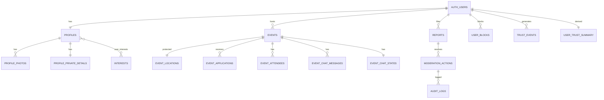

# Database Schema v1 — Social Events App

> **Status:** v1 (schema blueprint for closed beta)
> **Owner:** Technical / Backend
> **Last updated:** 2026-05-18

---

## 1. Source of Truth

- Документ основан на [`00_PRODUCT_CORE.md`](00_PRODUCT_CORE.md), [`01_PRD.md`](01_PRD.md), [`02_USER_STORIES.md`](02_USER_STORIES.md), [`03_USER_FLOWS.md`](03_USER_FLOWS.md), [`04_FIGMA_PROTOTYPE_PLAN.md`](04_FIGMA_PROTOTYPE_PLAN.md), [`05_ARCHITECTURE.md`](05_ARCHITECTURE.md).
- **[`00_PRODUCT_CORE.md`](00_PRODUCT_CORE.md) — first source of truth.** При конфликте приоритет у Product Core.
- Schema **не нарушает** safety-инварианты (Инварианты 1–10).
- Документ — основа будущих Supabase migrations (создаются **позже**, не сейчас).
- Полные RLS-политики — в [`/docs/07_SECURITY_RLS.md`](07_SECURITY_RLS.md).
- Нерешённые развилки — в [§32 Open Schema Questions](#32-open-schema-questions), не «додуманы» молча (CLAUDE.md §3).

> ⚠️ Это **blueprint**, а не миграции. Псевдо-SQL/таблицы ниже — описание, `.sql`-файлы и migrations не создаются на этом шаге.

---

## 2. Schema Goals

1. Поддержать MVP product loop (Discover → Apply → Approve → Attend → Reconnect).
2. Защитить exact location (отдельная protected-структура).
3. Поддержать approval-based participation.
4. Event chat только для approved attendees.
5. Trust system без публичного raw score.
6. Report/block/moderation/audit встроены.
7. Invite-only beta.
8. Analytics-friendly без хранения лишних sensitive данных.
9. Фундамент для future intelligence без переусложнения MVP.
10. Удобство для Supabase/PostgreSQL/RLS.

---

## 3. Schema Non-Goals (MVP)

Schema **не поддерживает сейчас**: payments · tickets · paid events · public followers · open DMs · dating matches · public ratings · live location · exact public map pins · complex recommendation graph · monetization · large marketplace · enterprise permissions.

> Эти сущности не закладываются в таблицы. Добавление — только через product decision + обновление Product Core (CLAUDE.md §2/§5). Часть enum-значений (`cohost`, `identity_reviewed`) зарезервированы «на будущее», но не используются логикой MVP.

---

## 4. Database Conventions

### Naming
- Таблицы: `snake_case` множественное число.
- Колонки/enum: `snake_case`.
- PK: `id uuid`.
- FK: `entity_id uuid`.
- Timestamps: `created_at`, `updated_at`.
- Soft delete: `deleted_at` где нужно.

### Common columns
Большинство таблиц: `id uuid pk`, `created_at timestamptz not null default now()`, `updated_at timestamptz not null default now()`.
Moderation-sensitive таблицы дополнительно: `created_by uuid null`, `updated_by uuid null`, `deleted_at timestamptz null`, `metadata jsonb null`.

### Security principles
- Sensitive данные отделены где возможно.
- **Exact location отделён** от публичных event-данных (`event_locations`).
- **Internal trust score отделён** от публичного профиля (`user_trust_summary`).
- Admin-only таблицы помечены.
- RLS обязателен для exposed таблиц.
- Service role — только server-side.

---

## 5. Enum Definitions

| Enum | Values | Used by | Notes |
|------|--------|---------|-------|
| `profile_status` | incomplete, active, restricted, suspended, banned, deleted | profiles | Гейтит доступ; banned/suspended — нет взаимодействия |
| `verification_level` | none, email_verified, phone_verified, identity_reviewed | profiles | `identity_reviewed` зарезервирован (не MVP) |
| `trust_tier` | new, verified, reliable, trusted_host, restricted, suspended | profiles, user_trust_summary | Derived, **нечисловой**; raw score не здесь |
| `event_status` | draft, pending_review, live, full, starting_soon, in_progress, completed, archived, cancelled_by_host, cancelled_by_admin, removed_for_safety | events | См. §23 transitions |
| `event_visibility` | public, unlisted, private | events | unlisted/private — Open Question (Q-PRV) |
| `location_reveal_policy` | after_approval, manual_host_release, near_start_time | events | Дефолт `after_approval` (Инвариант 1) |
| `application_status` | pending, approved, rejected, waitlisted, cancelled_by_user, attended, no_show | event_applications | См. §23 |
| `attendee_role` | host, cohost, attendee | event_attendees | `cohost` зарезервирован (не MVP, OD-7) |
| `attendance_status` | unknown, attended, no_show, excused_absence | event_attendees | Метод фиксации — OD-8 |
| `moderation_status` | not_required, pending, approved, flagged, rejected, removed | profile_photos, events, event_chat_messages | AI assistive |
| `report_status` | new, in_review, action_taken, dismissed, escalated | reports | — |
| `report_priority` | low, medium, high, critical | reports, suspicious_activity_events | AI risk → priority (assistive) |
| `report_category` | harassment, spam, scam, unsafe_behavior, inappropriate_content, fake_profile, event_safety, location_issue, other | reports | P0-набор — Open Question (AQ-MODCAT) |
| `moderation_action_type` | warn_user, restrict_user, unrestrict_user, ban_user, unban_user, remove_event, restore_event, hide_message, restore_message, freeze_chat, unfreeze_chat, dismiss_report, escalate_report, admin_note | moderation_actions | Serious → human + reason |
| `trust_event_type` | profile_completed, phone_verified, event_attended, event_no_show, host_positive_feedback, host_negative_feedback, report_received, block_received, moderation_warning, restriction_applied, suspicious_velocity, event_hosted_successfully | trust_events | Internal only |
| `notification_type` | application_approved, application_rejected, application_waitlisted, event_reminder, event_update, event_cancelled, new_application_for_host, report_update, invite_available, system_notice | notifications | Payload без exact location |
| `invite_code_status` | active, used, expired, revoked | invite_codes | — |
| `feature_flag_status` | active, inactive | feature_flags | Safety-флаги нельзя выключать без product decision |

---

## 6. Core Tables Overview

| Table | Domain | Purpose | P0/P1 | Sensitive? | RLS Required? |
|-------|--------|---------|-------|------------|---------------|
| profiles | Identity | Safe/public профиль | P0 | Частично | ✅ |
| profile_private_details | Identity | Приватные данные | P0 | **Высоко** | ✅ strict |
| profile_photos | Identity | Медиа профиля | P0 | Да | ✅ |
| interests | Identity | Глобальный список интересов | P0 | Нет | read public |
| user_interests | Identity | Связь user↔interest | P0 | Нет | ✅ |
| cities | Reference | Beta-города | P0 | Нет | read public |
| event_categories | Events | Категории MVP | P0 | Нет | read public |
| events | Events | Событие (без exact) | P0 | Частично | ✅ |
| event_locations | Events | **Exact location** | P0 | **Критично** | ✅ strict |
| event_applications | Applications | Заявки | P0 | Да | ✅ |
| event_attendees | Applications | Approved/attending | P0 | Да | ✅ |
| event_chat_messages | Messaging | Сообщения чата | P0 | Да | ✅ strict |
| event_chat_states | Messaging | Статус чата (freeze/expiry) | P0 | Да | ✅ |
| user_blocks | Safety | Блокировки | P0 | Да | ✅ |
| reports | Safety | Жалобы | P0 | **Высоко** | ✅ |
| moderation_actions | Safety | Действия модерации | P0 | **Высоко** | admin-only |
| audit_logs | Safety | Аудит | P0 | **Высоко** | admin-only, append |
| trust_events | Trust | Internal trust-сигналы | P0 | **Внутреннее** | admin/system-only |
| user_trust_summary | Trust | Derived trust | P0 | **Внутреннее** | admin/system-only |
| invite_codes | Beta | Invite-доступ | P0 | Да | ✅ |
| waitlist_entries | Beta | Лист ожидания | P0 | Да | ✅ |
| notifications | Notifications | In-app уведомления | P0 | Частично | ✅ |
| push_tokens | Notifications | Push-токены | P0 | Да | ✅ |
| feature_flags | Beta | Реестр флагов | P1 | Нет | admin-only |
| feature_flag_exposures | Beta | Экспозиции | P1 | Нет | ✅ |
| suspicious_activity_events | Safety | System/AI флаги | P0 | Да | admin/system-only |

---

## 7. Identity & Profile Tables

### 7.1 profiles
Purpose: публичная/safe информация профиля.

| Column | Type | Notes |
|--------|------|-------|
| id | uuid pk | |
| user_id | uuid fk auth.users unique not null | |
| username | text unique null | |
| display_name | text not null | |
| bio | text null | moderation при изменении |
| birth_year | int null | см. age_range (OD-2) |
| age_range | text null | предпочтительно вместо точного возраста |
| city_id | uuid fk cities null | |
| primary_intent | text null | non-romantic |
| vibe_tags | text[] default '{}' | |
| profile_status | profile_status not null default 'incomplete' | |
| verification_level | verification_level not null default 'none' | |
| trust_tier | trust_tier not null default 'new' | derived, нечисловой |
| profile_completeness | int not null default 0 | внутр. сигнал |
| is_private | boolean not null default false | privacy |
| onboarding_completed_at | timestamptz null | гейт доступа |
| last_active_at | timestamptz null | |
| created_at / updated_at | timestamptz | |
| deleted_at | timestamptz null | soft delete |

Sensitive: **raw trust score НЕ хранится здесь**; exact user location НЕ хранится; публичный доступ — только через `public_profiles_view`.
Indexes: `user_id` uniq, `username` uniq, `city_id`, `profile_status`, `verification_level`.
RLS: owner read/update own; другие — safe view; admin — server-side.

### 7.2 profile_private_details
Purpose: приватные/внутренние данные, не публичные.

| Column | Type | Notes |
|--------|------|-------|
| id | uuid pk | |
| user_id | uuid fk auth.users unique not null | |
| legal_name | text null | нужность в MVP — Open Question |
| phone_number | text null | sensitive |
| phone_verified_at | timestamptz null | trust-сигнал |
| email_verified_at | timestamptz null | |
| date_of_birth | date null | нужность в MVP — Open Question |
| internal_notes | text null | **admin-only** |
| created_at / updated_at | timestamptz | |

Sensitive: highly sensitive; никогда в публичном профиле; owner видит ограниченно (свой verification-статус), не admin-notes; strict RLS.

### 7.3 profile_photos

| Column | Type | Notes |
|--------|------|-------|
| id | uuid pk | |
| user_id | uuid fk auth.users not null | |
| storage_path | text not null | ссылка в Storage, не файл |
| position | int not null default 0 | |
| moderation_status | moderation_status not null default 'pending' | |
| moderation_reason | text null | |
| is_primary | boolean not null default false | |
| created_at / updated_at | timestamptz | |
| deleted_at | timestamptz null | |

Sensitive: unsafe/`flagged`/`rejected`/`deleted_at` фото не видны публично; видимость зависит от `moderation_status`.
Indexes: `user_id`, `moderation_status`, `(user_id, position)`.

### 7.4 interests
`id uuid pk`, `name text not null unique`, `category text null`, `is_active boolean not null default true`, `sort_order int not null default 0`, `created_at/updated_at`. Reference, read public.

### 7.5 user_interests
`user_id uuid fk auth.users`, `interest_id uuid fk interests`, `created_at timestamptz`. **PK (user_id, interest_id).** RLS: owner manage own.

### 7.6 cities
`id uuid pk`, `name text not null`, `country_code text not null`, `timezone text null`, `is_beta_active boolean not null default false`, `approximate_center_lat numeric null`, `approximate_center_lng numeric null`, `created_at/updated_at`. Используется для launch control; **exact user live location не хранится**.

---

## 8. Event Tables

### 8.1 event_categories
`id uuid pk`, `name text not null unique`, `description text null`, `icon_name text null`, `is_active boolean not null default true`, `sort_order int not null default 0`, `created_at/updated_at`.
Seed: Coffee / Casual meetup · Dinner / Brunch · Walk / City exploring · Board games · Light sports · Creative session · Community hangout. (Нет nightlife/dating/business — §9 Core.)

### 8.2 events
Purpose: основная таблица события, **без sensitive location**.

| Column | Type | Notes |
|--------|------|-------|
| id | uuid pk | |
| host_id | uuid fk auth.users not null | |
| category_id | uuid fk event_categories not null | |
| city_id | uuid fk cities not null | |
| title | text not null | moderation |
| description | text not null | moderation |
| starts_at | timestamptz not null | |
| ends_at | timestamptz null | |
| capacity | int not null | `capacity > 0` |
| approval_required | boolean not null default true | Инвариант 8 (в MVP всегда true) |
| waitlist_enabled | boolean not null default true | |
| visibility | event_visibility not null default 'public' | unlisted/private — Q-PRV |
| status | event_status not null default 'draft' | |
| location_reveal_policy | location_reveal_policy not null default 'after_approval' | Инвариант 1 |
| approximate_area_text | text null | публично |
| approximate_lat / approximate_lng | numeric null | **fuzzy**, не точные |
| moderation_status | moderation_status not null default 'pending' | |
| moderation_reason | text null | |
| published_at | timestamptz null | |
| cancelled_at | timestamptz null | |
| cancelled_by | uuid null | |
| cancellation_reason | text null | |
| created_at / updated_at | timestamptz | |
| deleted_at | timestamptz null | |

**Important: exact location НЕ в этой таблице** — только approximate. Discovery читает `public_events_view`.
Constraints: `capacity > 0`; `ends_at > starts_at` (если задан); `starts_at > now()` — валидируется в Edge Function (не строго DB).
Indexes: `host_id`, `city_id`, `category_id`, `status`, `starts_at`, `moderation_status`, `(city_id, status, starts_at)`, `(category_id, starts_at)`.

### 8.3 event_locations
Purpose: **защищённый exact location и инструкции.**

| Column | Type | Notes |
|--------|------|-------|
| id | uuid pk | |
| event_id | uuid fk events unique not null | 1:1 с событием |
| exact_location_text | text null | sensitive |
| exact_address | text null | sensitive |
| exact_lat / exact_lng | numeric null | sensitive |
| arrival_instructions | text null | sensitive |
| host_contact_note | text null | sensitive |
| created_at / updated_at | timestamptz | |

**Critical (Инвариант 1):** доступ только host / approved attendees / admin (server-side). pending/waitlisted/rejected/banned/blocked **не читают** эту таблицу. Notifications не содержат эти данные. Strict RLS / доступ через secure function/view.
Indexes: `event_id` unique.

---

## 9. Application & Attendance Tables

### 9.1 event_applications
| Column | Type | Notes |
|--------|------|-------|
| id | uuid pk | |
| event_id | uuid fk events not null | |
| user_id | uuid fk auth.users not null | |
| status | application_status not null default 'pending' | |
| intro_note | text null | moderation; виден только host |
| host_note | text null | host-only |
| decided_by | uuid fk auth.users null | |
| decided_at | timestamptz null | |
| cancelled_at | timestamptz null | |
| created_at / updated_at | timestamptz | |

Constraints: `unique(event_id, user_id)`.
Indexes: `event_id`, `user_id`, `status`, `(event_id, status)`, `(user_id, status)`.
Important: `approved` открывает доступ к exact location + chat; `rejected`/`waitlisted`/`pending` — нет. Смена статуса — через Edge Functions.

### 9.2 event_attendees
| Column | Type | Notes |
|--------|------|-------|
| id | uuid pk | |
| event_id | uuid fk events not null | |
| user_id | uuid fk auth.users not null | |
| role | attendee_role not null default 'attendee' | `cohost` зарезервирован |
| attendance_status | attendance_status not null default 'unknown' | |
| approved_application_id | uuid fk event_applications null | |
| joined_at | timestamptz not null default now() | |
| attendance_confirmed_at | timestamptz null | |
| removed_at | timestamptz null | |
| removed_by | uuid null | |
| removal_reason | text null | |
| created_at / updated_at | timestamptz | |

Constraints: `unique(event_id, user_id)`.
Indexes: `event_id`, `user_id`, `role`, `attendance_status`, `(event_id, role)`.
RLS: host видит список; approved могут видеть по политике (OD-12); non-approved — нет.

---

## 10. Messaging Tables

### 10.1 event_chat_messages
| Column | Type | Notes |
|--------|------|-------|
| id | uuid pk | |
| event_id | uuid fk events not null | |
| sender_id | uuid fk auth.users not null | |
| body | text not null | moderation возможна |
| moderation_status | moderation_status not null default 'not_required' | |
| moderation_reason | text null | |
| is_system_message | boolean not null default false | |
| system_message_type | text null | |
| reply_to_message_id | uuid fk event_chat_messages null | |
| created_at / updated_at | timestamptz | |
| deleted_at | timestamptz null | |
| deleted_by | uuid null | |

**Critical:** **no open DMs** — сообщения существуют только в контексте события. Read/write только approved attendees + host. Зарепорченные сообщения сохраняют контекст для модерации (политика приватности). rejected/waitlisted/pending — нет доступа; admin — server-side.
Indexes: `(event_id, created_at)`, `sender_id`, `moderation_status`, `deleted_at`.

### 10.2 event_chat_states
`id uuid pk`, `event_id uuid fk events unique not null`, `is_frozen boolean not null default false`, `frozen_by uuid null`, `frozen_at timestamptz null`, `freeze_reason text null`, `post_event_expires_at timestamptz null`, `created_at/updated_at`.
Notes: frozen → блок записи; freeze admin/host по политике (freeze admin → audit log); post-event expiry (OD-4) обрабатывается scheduled job.

---

## 11. Safety Tables

### 11.1 user_blocks
`id uuid pk`, `blocker_id uuid fk auth.users not null`, `blocked_id uuid fk auth.users not null`, `reason text null`, `created_at timestamptz`, `deleted_at timestamptz null`.
Constraints: `unique(blocker_id, blocked_id)`, `blocker_id <> blocked_id`.
Indexes: `blocker_id`, `blocked_id`, `(blocker_id, blocked_id)`.
Behavior: blocked не может apply к событиям блокирующего; не взаимодействует в чате; видимость профилей/событий — через queries/RLS/functions. Обратимость (unblock) — Open Question (Q-BLK), отражено наличием `deleted_at`.

### 11.2 reports
| Column | Type | Notes |
|--------|------|-------|
| id | uuid pk | |
| reporter_id | uuid fk auth.users not null | reporter safety |
| reported_user_id | uuid fk auth.users null | |
| reported_event_id | uuid fk events null | |
| reported_message_id | uuid fk event_chat_messages null | |
| category | report_category not null | |
| description | text null | sensitive, не в analytics |
| status | report_status not null default 'new' | |
| priority | report_priority not null default 'medium' | |
| assigned_admin_id | uuid null | |
| ai_summary | text null | **assistive only** (Инвариант 5) |
| admin_resolution_note | text null | admin-only |
| resolved_at | timestamptz null | |
| created_at / updated_at | timestamptz | |

Constraints: ≥1 из `reported_user_id`/`reported_event_id`/`reported_message_id` not null.
Indexes: `reporter_id`, `reported_user_id`, `reported_event_id`, `reported_message_id`, `status`, `priority`, `created_at`.
RLS: user создаёт; reporter видит ограниченный статус своих; admin — full server-side; reports **не публичны**; no retaliation.

### 11.3 suspicious_activity_events
`id uuid pk`, `user_id uuid fk auth.users null`, `event_id uuid fk events null`, `activity_type text not null`, `severity report_priority not null default 'medium'`, `description text null`, `metadata jsonb null`, `reviewed_at timestamptz null`, `reviewed_by uuid null`, `created_at timestamptz`.
Notes: system/AI флаг, **не финальный enforcement** (Инвариант 5); для moderation queue/admin review.

---

## 12. Moderation & Audit Tables

### 12.1 moderation_actions
| Column | Type | Notes |
|--------|------|-------|
| id | uuid pk | |
| action_type | moderation_action_type not null | |
| actor_admin_id | uuid null | |
| target_user_id | uuid fk auth.users null | |
| target_event_id | uuid fk events null | |
| target_message_id | uuid fk event_chat_messages null | |
| related_report_id | uuid fk reports null | |
| reason | text not null | **обязательна** для serious |
| metadata | jsonb null | |
| created_at | timestamptz | |

Important: каждое серьёзное действие требует `reason`; **каждое действие → запись в `audit_logs`** (Инвариант 4); AI не финальный актор для serious (Инвариант 5).
Indexes: `action_type`, `actor_admin_id`, `target_user_id`, `target_event_id`, `related_report_id`, `created_at`.

### 12.2 audit_logs
| Column | Type | Notes |
|--------|------|-------|
| id | uuid pk | |
| actor_id | uuid null | |
| actor_type | text not null | admin/system/user |
| action | text not null | |
| entity_type | text not null | |
| entity_id | uuid null | |
| before_state | jsonb null | redact sensitive |
| after_state | jsonb null | redact sensitive |
| metadata | jsonb null | |
| ip_address | inet null | |
| user_agent | text null | |
| created_at | timestamptz | |

Notes: **append-only** (без update/delete); для moderation/security review; admin-действия логируются; sensitive значения редактируются; retention — OD-9.
Indexes: `actor_id`, `actor_type`, `(entity_type, entity_id)`, `action`, `created_at`.

---

## 13. Trust Tables

### 13.1 trust_events
`id uuid pk`, `user_id uuid fk auth.users not null`, `event_type trust_event_type not null`, `weight numeric not null default 0`, `source text not null`, `related_event_id uuid fk events null`, `related_report_id uuid fk reports null`, `metadata jsonb null`, `created_at timestamptz`.
Important: **append-only, internal only**; не видно обычным пользователям; используется для деривации summary/tier.
Indexes: `user_id`, `event_type`, `related_event_id`, `created_at`.

### 13.2 user_trust_summary
| Column | Type | Notes |
|--------|------|-------|
| user_id | uuid pk fk auth.users | |
| trust_score_internal | numeric not null default 0 | **никогда не на клиент** |
| trust_tier | trust_tier not null default 'new' | derived |
| attended_events_count | int not null default 0 | |
| hosted_events_count | int not null default 0 | |
| no_show_count | int not null default 0 | |
| report_count | int not null default 0 | |
| block_count | int not null default 0 | |
| last_trust_event_at | timestamptz null | |
| updated_at | timestamptz | |

**Critical (Инвариант 3/10):** `trust_score_internal` никогда не exposed пользователям; публичный UI — только approved badges; нет публичных негативных ярлыков. RLS: admin/system-only; mobile public API не возвращает таблицу.

---

## 14. Beta & Access Tables

### 14.1 invite_codes
`id uuid pk`, `code text unique not null`, `status invite_code_status not null default 'active'`, `created_by uuid null`, `assigned_to_email text null`, `used_by uuid fk auth.users null`, `used_at timestamptz null`, `expires_at timestamptz null`, `max_uses int not null default 1`, `use_count int not null default 0`, `metadata jsonb null`, `created_at/updated_at`.
Indexes: `code` uniq, `status`, `used_by`. Использование атомарно (race) — через Edge Function `invite_code_validation`.

### 14.2 waitlist_entries
`id uuid pk`, `email text not null`, `city_id uuid fk cities null`, `name text null`, `source text null`, `status text not null default 'new'`, `invited_at timestamptz null`, `created_at/updated_at`.
Indexes: `email`, `city_id`, `status`, `created_at`. Минимизация PII.

---

## 15. Notifications Tables

### 15.1 notifications
`id uuid pk`, `user_id uuid fk auth.users not null`, `type notification_type not null`, `title text not null`, `body text not null`, `related_event_id uuid fk events null`, `related_application_id uuid fk event_applications null`, `related_report_id uuid fk reports null`, `read_at timestamptz null`, `metadata jsonb null`, `created_at timestamptz`.
Privacy: **никакого exact location** в `title`/`body`/`metadata` для кого-либо; sensitive детали тянутся с авторизованного экрана. Indexes: `(user_id, created_at)`, `(user_id, read_at)`, `type`.

### 15.2 push_tokens
`id uuid pk`, `user_id uuid fk auth.users not null`, `token text not null`, `platform text not null`, `is_active boolean not null default true`, `last_used_at timestamptz null`, `created_at/updated_at`.
Constraints: `unique(token)`. Indexes: `user_id`, `is_active`.

---

## 16. Feature Flags Tables

### 16.1 feature_flags
`id uuid pk`, `key text unique not null`, `description text null`, `status feature_flag_status not null default 'inactive'`, `rollout_percentage int null`, `metadata jsonb null`, `created_at/updated_at`. (Опционально, если не полностью в PostHog.) Safety-флаги нельзя выключать без product decision.

### 16.2 feature_flag_exposures
`id uuid pk`, `user_id uuid fk auth.users null`, `flag_key text not null`, `variant text null`, `exposed_at timestamptz not null default now()`, `metadata jsonb null`.
Indexes: `user_id`, `flag_key`, `exposed_at`.

---

## 17. Public / Safe Views (blueprint, не финальный SQL)

### 17.1 public_profiles_view
Include: `user_id`, `display_name`, `bio`, `city_id`, `primary_intent`, `vibe_tags`, `profile_completeness` (bucket), `verification_level`, public badges (derived из `trust_tier`, нечисловые), `primary_photo_url` только если фото `moderation_status='approved'`.
**MUST NOT include:** `phone_number`, `email`, `date_of_birth`, `legal_name`, `trust_score_internal`, `internal_notes`, `report_count`, `block_count`, exact location.

### 17.2 public_events_view
Include: `event_id`, `host_id`, `category_id`, `city_id`, `title`, `description`, `starts_at`, `ends_at`, `capacity`, `approximate_area_text`, `approximate_lat/lng` (fuzzy), `approval_required`, `waitlist_enabled`, `status`, `moderation_status`, `attendee_count` (агрегат, опц.). Текущий `application_status` пользователя — отдельным query/function.
**MUST NOT include:** `exact_location_text`, `exact_address`, `exact_lat`, `exact_lng`, `arrival_instructions`.

### 17.3 approved_event_details_view
Include (только approved attendee / host / admin): exact location, arrival instructions, chat availability, approved attendee info (по политике OD-12).
**Critical:** защищён RLS или возвращается через secure function; недоступен pending/waitlisted/rejected.

---

## 18. Relationship Map

```
auth.users
 ├─ profiles ─┬─ profile_photos
 │            ├─ profile_private_details (1:1)
 │            └─ user_interests ── interests
 │
 ├─ events (as host) ─┬─ event_locations (1:1, protected)
 │                     ├─ event_applications ── event_attendees
 │                     ├─ event_chat_messages
 │                     └─ event_chat_states (1:1)
 │
 ├─ reports (as reporter; targets user/event/message)
 ├─ user_blocks (blocker / blocked)
 ├─ trust_events ── user_trust_summary (derived, internal)
 ├─ moderation_actions (target) ── audit_logs
 ├─ invite_codes (used_by) / waitlist_entries
 ├─ notifications / push_tokens
 └─ feature_flag_exposures

cities ──< profiles, events
event_categories ──< events
```



---

## 19. Access Sensitivity Matrix

| Table | Public User | Owner | Host | Approved Attendee | Admin | Sensitive Fields |
|-------|:-----------:|:-----:|:----:|:-----------------:|:-----:|------------------|
| profiles | safe view | R/W own | safe view | safe view | full (SS) | trust_tier raw n/a, completeness |
| profile_private_details | ❌ | R limited | ❌ | ❌ | full (SS) | phone, DOB, legal_name, notes |
| events | safe view | R/W own | R/W own | R | full (SS) | exact n/a here |
| event_locations | ❌ | host R/W | host R/W | **R** | full (SS) | exact location/instructions |
| event_applications | ❌ | applicant R own | R for own event | applicant R own | full (SS) | intro_note, host_note |
| event_attendees | ❌ | R own row | R own event | R (policy OD-12) | full (SS) | removal_reason |
| event_chat_messages | ❌ | sender R/W | R/W (own event) | **R/W** | full (SS) | body |
| reports | ❌ | reporter R limited | ❌ | ❌ | full (SS) | description, ai_summary |
| user_blocks | ❌ | R/W own | ❌ | ❌ | full (SS) | reason |
| trust_events | ❌ | ❌ | ❌ | ❌ | full (SS) | всё |
| user_trust_summary | ❌ | ❌ | ❌ | ❌ | full (SS) | score, counters |
| moderation_actions | ❌ | ❌ | ❌ | ❌ | full (SS) | reason, target |
| audit_logs | ❌ | ❌ | ❌ | ❌ | R append (SS) | actor/target/state |

(SS = server-side / service role only.) Цель: визуально показать таблицы со strict RLS.

---

## 20. Location Privacy Schema Design *(критический раздел)*

- **Exact location вынесен в `event_locations`** (отдельная таблица 1:1), чтобы RLS точечно защищал именно sensitive-данные и их нельзя было случайно вернуть в discovery-запросе.
- **Discovery читает approximate-поля** из `events`/`public_events_view` — там нет exact.
- **`application_status` управляет доступом**: только `approved` (+ host/admin) проходит RLS-проверку на `event_locations` и `event_chat_messages`.
- Approved attendee получает exact через `approved_event_details_view` / secure function (после RLS-проверки наличия `approved` записи в `event_attendees`/`event_applications`).
- pending/waitlisted/rejected/banned/blocked — RLS отклоняет чтение `event_locations`.
- Notifications не хранят exact (см. §15) — Инвариант 1/9.
- Analytics никогда не получает exact (см. §27) — Инвариант 9.

| User State | events approximate fields | event_locations | event_chat_messages |
|------------|:------------------------:|:---------------:|:-------------------:|
| guest | ❌ | ❌ | ❌ |
| authenticated_not_onboarded | ❌ | ❌ | ❌ |
| onboarded (не подал) | ✅ | ❌ | ❌ |
| pending | ✅ | ❌ | ❌ |
| waitlisted | ✅ | ❌ | ❌ |
| approved | ✅ | ✅ | ✅ |
| rejected | ограниченно | ❌ | ❌ |
| blocked | ❌ | ❌ | ❌ |
| restricted | по политике | по статусу заявки | ограниченно |
| banned | ❌ | ❌ | ❌ |
| host (свои) | ✅ | ✅ | ✅ |
| admin | ✅ | ✅ (logged, SS) | ✅ (SS) |

---

## 21. Indexing Plan

**Discovery:** `events(city_id, status, starts_at)`, `events(category_id, starts_at)`, `events(moderation_status)`, `events(visibility)`.
**Applications:** `event_applications(event_id, status)`, `event_applications(user_id, status)`, `event_applications(event_id, user_id)` unique.
**Chat:** `event_chat_messages(event_id, created_at)`, `event_chat_messages(sender_id)`, `event_chat_messages(moderation_status)`.
**Safety:** `reports(status, priority)`, `reports(reported_user_id)`, `reports(reported_event_id)`, `user_blocks(blocker_id, blocked_id)`.
**Trust:** `trust_events(user_id, created_at)`, `trust_events(event_type)`, `user_trust_summary(user_id)`.
**Admin:** `moderation_actions(target_user_id)`, `moderation_actions(target_event_id)`, `audit_logs(entity_type, entity_id)`, `audit_logs(created_at)`.

---

## 22. Constraints & Data Integrity

| Constraint | Уровень |
|------------|---------|
| Unique profile per auth user | DB (`profiles.user_id` unique) |
| Unique application per user/event | DB (`unique(event_id,user_id)`) |
| Unique attendee per user/event | DB (`unique(event_id,user_id)`) |
| Capacity positive | DB (`check capacity > 0`) |
| Cannot block self | DB (`check blocker_id<>blocked_id`) |
| starts_at < ends_at (если есть) | DB (`check`) |
| Invite code unique | DB (`code unique`) |
| One primary photo per user | Business logic / partial unique (если форсим) |
| Report targets ≥1 entity | DB (`check` not-all-null) |
| Approved application → attendee record | **Edge Function** (`approve_application`) |
| Rejected/waitlisted → no attendee | Business logic (Edge Function) |
| No chat message without event+sender | DB (`not null` FK) |
| No event_location without event | DB (`fk event_id not null unique`) |
| Capacity race (approve over capacity) | **Edge Function** (transaction/lock) |

Правило: целостность данных — DB constraints; **бизнес-инварианты доступа/lifecycle/capacity — Edge Functions** (server-authoritative).

---

## 23. Lifecycle Data Rules

### Event status transitions
`draft → pending_review | live` · `pending_review → live | removed_for_safety` · `live → full | starting_soon | completed | cancelled_by_host | cancelled_by_admin` · `full → live (освободилось место)` · `starting_soon → in_progress` · `in_progress → completed` · `completed → archived` · `live|starting_soon|in_progress → cancelled_by_host|cancelled_by_admin` · `any → removed_for_safety`.

### Application status transitions
`pending → approved | rejected | waitlisted | cancelled_by_user` · `waitlisted → approved | rejected | cancelled_by_user` · `approved → attended | no_show | cancelled_by_user (по политике)` · `rejected` terminal · `no_show` terminal (attendance).

| Transition | notifications | audit_logs | trust_events | attendee record | location/chat access |
|------------|:-------------:|:----------:|:------------:|:---------------:|----------------------|
| application→approved | ✅ user | — (admin-only events logged) | path к reliability | **create/link** | **grant** exact+chat |
| application→rejected | ✅ user | — | нейтрально | — | стаётся закрыт |
| application→waitlisted | ✅ user | — | — | — | нет |
| approved→attended | — | — | + attended | update | exact (истор.) |
| approved→no_show | ✅ user (нейтр.) | — | − no_show | update | нет |
| event→cancelled_by_admin | ✅ all | ✅ | возможн. host signal | — | revoke |
| event→removed_for_safety | ✅ all | ✅ | возможн. host signal | — | revoke |
| chat freeze (admin) | — | ✅ | — | — | block writes |
| ban/restrict user | ✅ user | ✅ | restriction_applied | — | revoke interaction |

---

## 24. Derived Data & Counters

| Field | Source | Update via | P0 | Visible to users |
|-------|--------|-----------|----|------------------|
| profile_completeness | profiles + photos + verification | function/job | P0 | bucket only (не точное число как «score») |
| attendee_count | event_attendees | aggregate/job | P0 | да (агрегат) |
| application_count / pending_application_count | event_applications | aggregate | P0 | host only |
| trust_score_internal | trust_events | function/job | P0 | **❌ никогда** |
| trust_tier | trust_events/summary | function/job | P0 | только как нечисл. badge |
| attended_events_count | trust_events/attendees | job | P0 | как badge basis, не число |
| hosted_events_count | events | job | P0 | как badge basis |
| no_show_count | trust_events | job | P0 | **❌** (внутр.) |
| report_count / block_count | reports/blocks | job | P0 | **❌** (внутр.) |

**Critical:** `trust_score_internal` и safety-счётчики (no_show/report/block) — внутренние; не в публичных view/API (Инвариант 3/10).

---

## 25. Storage Buckets & DB References

| Bucket | Referenced by | Upload | Visible | Notes |
|--------|---------------|--------|---------|-------|
| `profile-photos` | `profile_photos.storage_path` | owner | только после `moderation_status='approved'` | Signed URLs; size/type limits; cleanup при удалении профиля |
| `event-media` (P1) | event ref (если добавим) | host | по доступу к событию | Moderation обязательна |
| `moderation-attachments` (P1) | report ref | system/admin | admin-only | Server-side only |

DB хранит `storage_path`, не файл; доступ к медиа защищён policies/signed URLs; удаление профиля/события запускает media cleanup (safety-retention §28).

---

## 26. Seed Data Plan (local/staging)

Категории · interests · одна beta city. Тест-пользователи: onboarded user · host · approved attendee · waitlisted user · rejected user · admin · banned user. Сэмпл-события: live · full · pending_review · approved (с exact location в `event_locations`) · cancelled. Сэмпл reports · trust events · invite codes.
**Важно:** без реальных персональных данных, без production-секретов; seed должен позволять тестировать location privacy (approved видит `event_locations`, остальные — нет).

---

## 27. Analytics Data Boundary

**НЕ отправлять в analytics:** exact location/address · raw message body · phone number · email (если не hashed/разрешено политикой) · `trust_score_internal` · report descriptions · private moderation notes.
**Можно:** event/category/city IDs · status values · funnel steps · boolean flags · counts · non-sensitive metadata.
(Соответствует [`05_ARCHITECTURE.md`](05_ARCHITECTURE.md) §20, Инвариант 3/9.)

---

## 28. RLS Preparation Notes (для [`07_SECURITY_RLS.md`](07_SECURITY_RLS.md))

- **Profiles:** owner update own; safe public — через view; private details strict (admin-only для internal_notes).
- **Events:** safe-поля читаемы onboarded; host управляет своими; exact protected (`event_locations`).
- **Applications:** applicant читает свои; host — для своего события; смена статуса через Edge Function.
- **Chat:** только approved attendees + host; frozen → блок записи; rejected/waitlisted — нет доступа.
- **Reports:** user создаёт; admin управляет server-side; не публичны.
- **Trust:** internal only; raw score не exposed нигде на клиенте.
- **Admin:** server-side only; service role не на клиенте.

---

## 29. Migration Planning Notes (порядок, миграции создаются позже)

1. extensions (если нужны) → 2. enums → 3. reference tables (cities, interests, event_categories) → 4. profiles + profile_private_details → 5. events/categories/cities-связи → 6. event_locations → 7. applications/attendees → 8. chat tables → 9. safety tables → 10. moderation/audit → 11. trust tables → 12. beta/invite → 13. notifications → 14. feature flags → 15. indexes → 16. views → 17. enable RLS → 18. policies → 19. seed.
> Фактические migrations создаются на следующем этапе разработки; этот документ — только план.

---

## 30. Testing Requirements for Schema

- user имеет ровно один profile;
- в `events` нет exact location; exact только в `event_locations`;
- одна заявка на (user, event); один attendee на (user, event);
- approved application создаёт/связывает `event_attendees`; rejected — нет;
- non-approved не читает `event_chat_messages` и `event_locations`;
- blocked не может apply к событиям блокирующего;
- report таргетит хотя бы одну сущность; moderation action требует reason;
- `trust_score_internal` отсутствует в `public_profiles_view`;
- `flagged`/`rejected`/`deleted` фото не видны публично;
- invite code usage трекается и атомарен.

---

## 31. Schema Risks

| Risk | Impact | Mitigation |
|------|--------|------------|
| Exact location в неверной таблице | Критический (privacy breach) | Отдельная `event_locations`; RLS-тесты; review |
| Public view раскрывает sensitive | Высокий | Явный allowlist полей во view; тесты |
| Raw trust score exposed | Высокий | Отдельная `user_trust_summary`, admin-only; запрет в view |
| Слишком широкий доступ к чату | Высокий | RLS по approved; тесты rejected/waitlisted |
| Несогласованность статуса заявки | Средний | Смена статуса только через Edge Function |
| Race при capacity (approve) | Средний | Транзакция/lock в `approve_application` |
| Дубли attendee | Средний | `unique(event_id,user_id)` |
| Reports раскрывают приватные данные | Высокий | RLS reports не публичны; redaction в audit |
| Misuse admin/service role | Критический | Service role server-side; CI secret-check |
| Stale cache после approve/reject | Средний | Инвалидация по статусу; refetch on focus |
| Слишком много данных в analytics | Средний | Analytics boundary §27 |
| Переусложнённая схема рано | Средний | v1 минимальна; зарезервированные enum без логики |

---

## 32. Open Schema Questions

| # | Вопрос | Связь |
|---|--------|-------|
| AQ-GEO | PostGIS или numeric lat/lng для MVP? | §8, Arch AQ-GEO |
| AQ-LOC | Exact location в `event_locations` или encrypted fields? (текущее: отдельная таблица) | §8.3/§20 |
| OD-12 | Показывать approved attendees list до события? | §9.2/§17.3 |
| OD-7 | Cohost role в MVP или зарезервировать? (текущее: зарезервировано) | §5/§9.2 |
| OD-1 | Phone verification до apply или approval? | §9.1/§7.2 |
| OD-3 | Какие поля host видит в applicant safe profile? | §9.1/§17.1 |
| Q-CHAT-RET | Сколько хранить `event_chat_messages`? | §10.1/§28 |
| Q-MSG-SNAP | Снапшотить ли body зарепорченного сообщения в reports? | §11.2 |
| OD-9 | Сколько хранить `audit_logs`/safety records? | §12.2/§28 |
| OD-8 | Как считать no-show? | §9.2/§23 |
| Q-FEEDBACK | Нужна ли отдельная таблица host feedback? (сейчас через `trust_events`) | §13.1 |
| Q-REVIEWS | Нужна ли `event_reviews`, раз public ratings запрещены? (по умолчанию — нет) | §3, Инвариант 10 |
| Q-GEO-TAX | Как управлять city/area taxonomy? | §7.6 |
| Q-PRV | Нужны ли private/unlisted events в MVP? | §5/§8.2 |
| Q-IMG | Нужны ли event images в MVP? | §25 |

---

## 33. Summary

- Schema поддерживает core loop **Discover → Apply → Approve → Attend → Reconnect**.
- **Exact location вынесен в protected `event_locations`** (1:1, strict RLS); discovery — только approximate.
- **Trust score internal only** (`user_trust_summary`, admin/system); публично — нечисловые badges.
- Report/block/moderation/audit/trust/beta встроены в MVP-схему; audit append-only.
- Enum'ы, таблицы, индексы, views, constraints, lifecycle-правила, RLS-notes и migration order готовы как основа будущих migrations.
- Нерешённые развилки — §32; следующий документ: [`/docs/07_SECURITY_RLS.md`](07_SECURITY_RLS.md).

> Напоминание: [`/docs/00_PRODUCT_CORE.md`](00_PRODUCT_CORE.md) — first source of truth; все документы и эта схема ему подчинены. Migrations/SQL-файлы не создавались.
